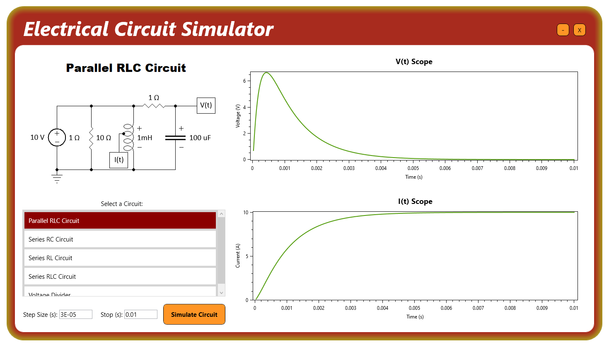

# Electrical Circuit Simulator
## Running the Software
- To run the software, download the latest release off Github. If you don't already have it, you will be prompted to install the .NET 8.0 desktop runtime first.
## About the Software
- Electrical Circuit Simulator is an app that can simulate electrical circuits via converting them into resistance/current matrices, and then solving for the node voltages via PLU matrix factorization.
- Note that Electrical Circuit Simulator is not a marketing term or a brand name, but simply a description of what the app does.
- This software uses Oxyplot as the graphing utility. 
- This software and its source code are released under the MIT license. Oxyplot is also released under the MIT license.
- This app is x64, and is Windows-only due to using C++/CLI to join the C# UI code to the C++ simulation engine code.
## User Interface
- The app has a list of circuits you can simulate, and you can also specify the time step and stop time to use in the simulations.

## Creating/Modifying Circuits
- The software will load circuit files and their associated image files from the relative file location 'ElectricalCircuitSimulator\Circuits'. 
- Circuit files support any number of components, but only one voltage and one current scope.
- Circuit files follow the format:
	- \<Circuit Name\>
	- \<Components\>
	- ScopeV(\<0-based node index\>)
	- ScopeI(\<0-based component index\>)
	- TimeStep(\<value\>)
	- StopTime(\<value\>)